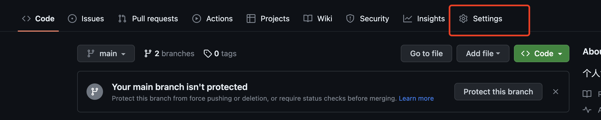
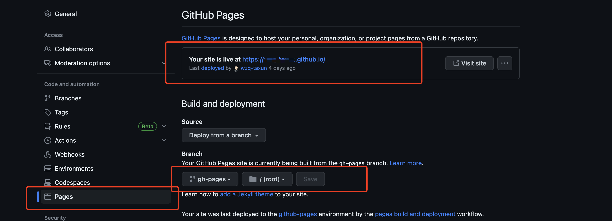

**前端部署vue静态项目到 githup 的方法**

<u>第一步</u>：创建一个以 `xxxx.github.io `的仓库（x x x: 自己githup账号名）

第二步：git  clone xxx(仓库地址)

第3步：在main 分支开发项目

第4步： 本地创建新分支并切换到该分支

```javascript
git checkout -b gh-pages
```

第5步：打包项目

```
npm run build   生成 dist 文件夹
```

第6步：在 gh-pages 分支 执行

```js
git add dist
git commit -m "xxxx"
git subtree push --prefix dist origin gh-pages (最关键)
```

第7步：在项目仓库里修改访问位置




